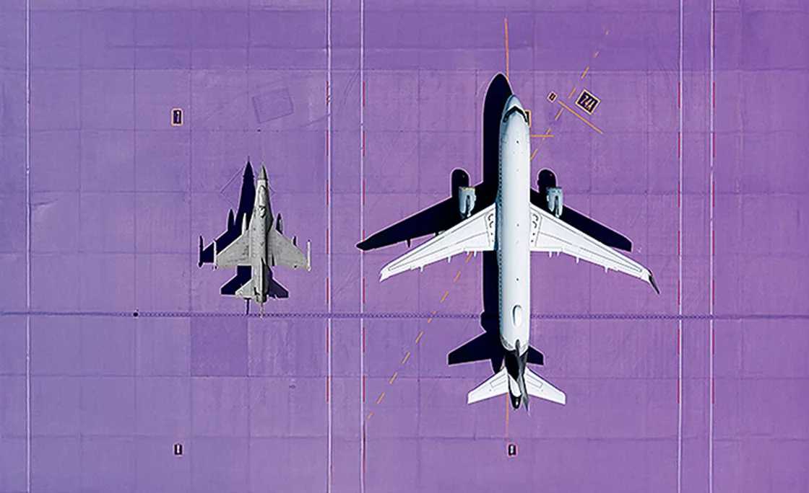

# Introdução

## Integrantes

-   Davi Atayde Cunha
-   Luiz Gustavo Lopes
-   Pedro Henrique Balduino
-   Vinícius Gabriel Marques de Melo

# O ar pode derrubar um avião

::: subtitle
E também economizar milhões em combustível.
:::

------------------------------------------------------------------------

## Por que Aviões Voam?

-   Aerodinâmica e Coeficientes Aerodinâmicos

::: notes
Para começar, dar uma palinha sobre a aerodinâmica e os coeficientes aerodinâmicos. A
:::

## Mas então...

-   O que faz um avião subir?
-   Por que aviões tem formatos diferentes?

::: notes
O avião sobe por conta da aerodinâmica e esses formatos diferentes mudam a forma na qual os coeficientes agem sobre o avião.

Mas o que é exatamente a aerodinâmica?

A aerodinâmica é um ramo da física dentro da mecânica dos fluidos (sim, o ar é um fluido) que estuda o movimento do ar e as forças que ele exerce sobre corpos sólidos em movimento ou imersos nele. Ou seja no avião, na pá do ventilador sobre o ar.

Agora os coeficientes aerodinâmicos são grandezas que quantificam o comportamento desses objetos em um fluido. Como exemplo a força de resistência, sustentação, instabilidade.
:::

# DA PÁ DO VENTILADOR AO CAÇA MILITAR

::: subtitle
Ela muda tudo. E ela está em tudo.
:::

------------------------------------------------------------------------

## A Aerodinâmica Muda Tudo

-   Preço dos Combustíveis
-   Segurança
-   Consumo de Combustível e Energia
-   Estabilidade

::: notes
Perceba que o estudo de aerodinâmica tem alta relevância, já que permite com que melhoremos a eficiência, segurança, o consumo de combustível e energia, estabilidade e outros fatores do recurso que depende dela.
:::

------------------------------------------------------------------------

## A aerodinâmica Está em Tudo

-   Aviões Comerciais e Aviões Militares
-   Helicópteros e Drones
-   Carros Convencionais e Carros de Fórmula 1
-   Trens e Metrôs de Alta Velocidade
-   Ventiladores e Hélices Eólicas

::: notes
A aerodinâmica está em diversas formas nos mesmos produtos A estrutura de um helicóptero, ou de um trem, ou de uma hélice tem sua dinâmica totalmente mudada por conta da aerodinâmica. É ela que dita a diferença de um avião comercial pra um caça militar, de um helicóptero para um drone, de um carro convencional para um carro de fórmula um e alto desempenho. De um trêm para um metrô ou das pás de um ventilador para hélices eólicas.

Existe infinidade de coisas no nosso dia a dia que dependem do estudo da aerodiâmica, que a gente não dá a devida importância porque nós não precisamos nos preocupar com esses fatores no dia a dia. Mas o estudo e o trabalho por trás dela gera um impacto gigantesco no mundo do qual conhecemos.
:::

------------------------------------------------------------------------

# A Aerodinâmica é Essencial

::: subtitle
E não é só sobre aviões. Mas hoje, falaremos de aviões.
:::

::: notes
Com isso, espero que vocês também tenham em mente com a gente que a aerodinâmica tá longe de ser só sobre aviões. Mas hoje, falaremos de aviões.
:::

# Dashboard

::: subtitle
Entendendo comportamentos da aerodinâmica por meio de visualizações.
:::

::: notes
Agora partiremos para as demonstrações gráficas e o Dashboard.
:::

## Dashboard {.full-iframe background-iframe="http://localhost:3838/" background-size="cover"}

::: notes
Se clicar no Dashboard, o foco sai do slide e as setas param de funcionar. Clique nessa janela de apresentação para voltar a navegar.
:::

# Descoberta

::: subtitle
Então com isso concluimos que \[...\]
:::

# Perguntas?

::: notes
Com isso, terminamos a nossa apresentação, esperamos que tenham gostado. Alguém teria alguma pergunta?
:::
